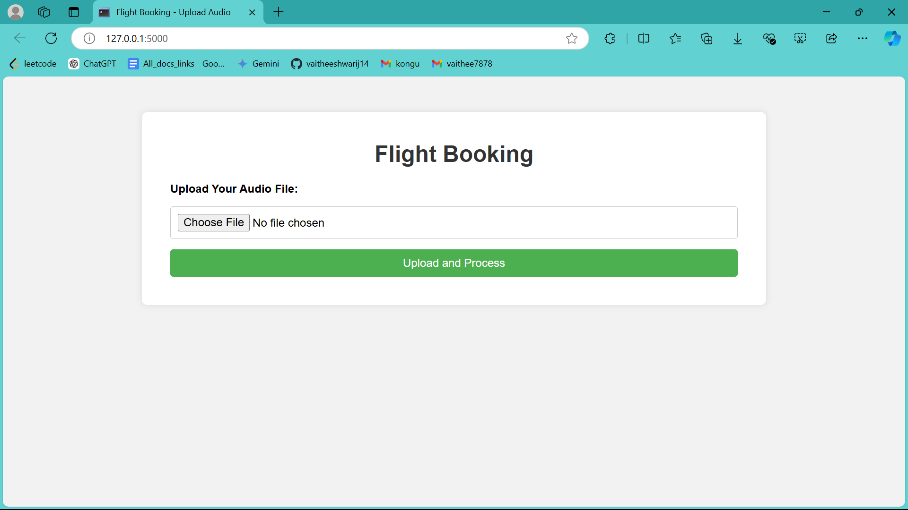
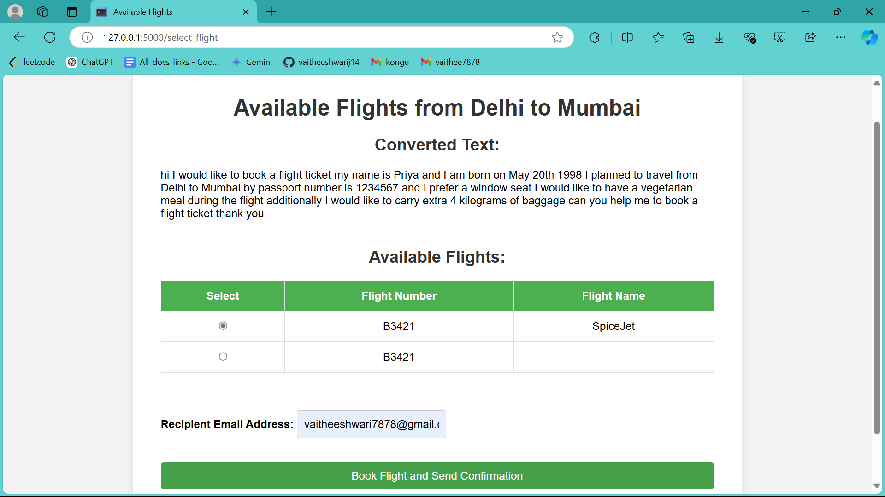
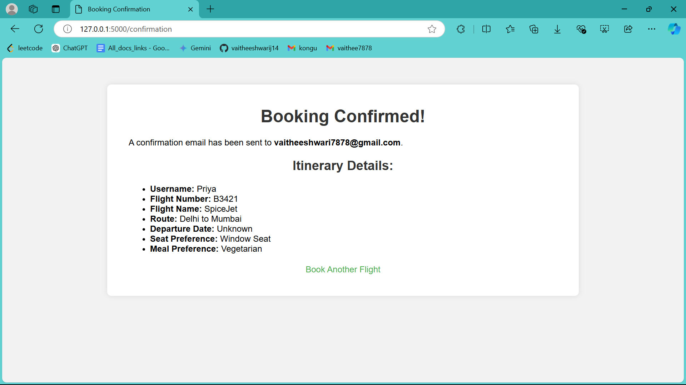
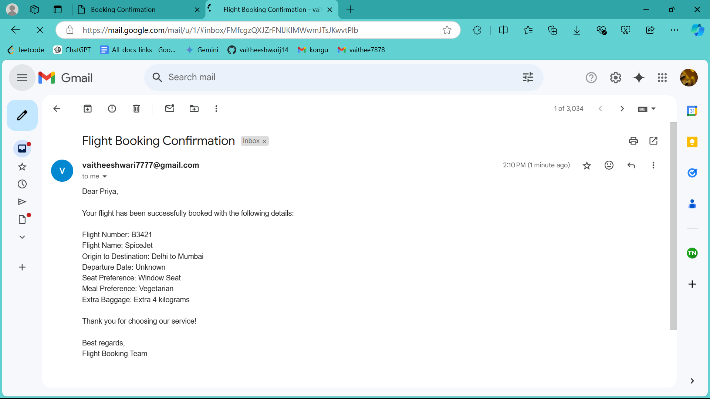

# Flight Ticket Booking AI

## Overview

This project implements an Agentic AI Workflow for Voice-Based Flight Ticket Booking. The application takes an audio file containing flight booking details, processes it, and confirms the availability of flights.

## Prerequisites

Before you begin, ensure you have the following installed:

- Python 3.x
- pip (Python package installer)

## Installation

1. Clone the repository:

   ```bash
   git clone https://github.com/vaitheeshwarij14/Flight_ticket_booking.git
   cd Flight_ticket_booking
   ```

2. Install the required packages:

   ```bash
   pip install -r requirements.txt
   ```

3. Set up your environment variables:

   - Create a file named `secure.env` in the root directory.
   - Add your credentials in the following format:

     ```plaintext
     SENDER_EMAIL=<Sender_Email_id>
     SENDER_PASSWORD=<Sender_password>
     COHERE_API_KEY=<Sender_cohere_api_key>

     ```

## Usage

1. Prepare your audio file containing the details to book flights.
2. Place the audio file in the appropriate directory.
3. Run the application:

   ```bash
   python app.py
   ```

## Images

Below are some images related to the project:

Run app.py




Choose the audio file and click on the upload and process.


Choose a flight from the available options and provide the recipient's email address and click on the book flight and send confirmation.




This window confirms that your booking is complete and reminds you to check your email for the confirmation details. 




This is the confirmation email that you will receive.



